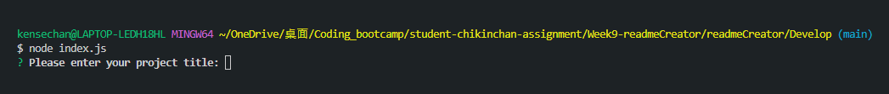
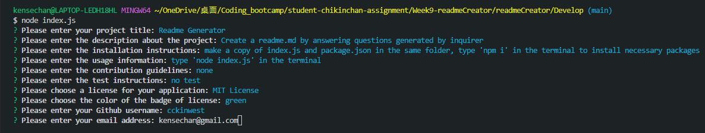
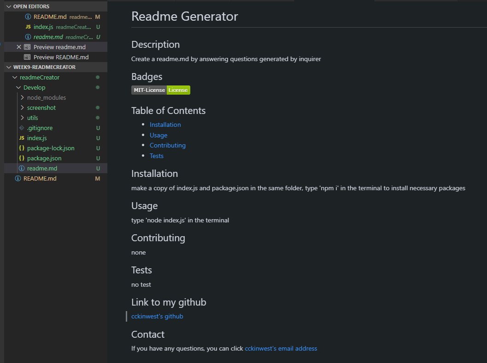

# readmeCreator

## Description

My task is to create a command-line application that dynamically generates a professional README.md file from a user's input using the Inquirer package.

## Functionality

When running the index.js, the inquirer will ask several questions about the project title, the description of the project, the installation guide, the usage, the contributing, the test, the license, the username of github, and the email for contact. Then markup will be generated and put the answers of the questions into respective parts of the readme. A professional readme with sections, table of contents, and image of badge will be created.

## Installation

Have a copy of the index.js and package.json in the same folder. Then run 'npm i' in the terminal and all the required packages will be installed automatically. Run 'node index.js' to run the code.

## screenshots

#### First enter 'node index.js' to run the code.

#### Then answer the questions.

#### Finally a professional readme is generated as a result.

## Link to the video

[Walk through of the application](https://drive.google.com/file/d/1dKDHKuZnuDM4bX58rylICtWgcTqh3LLa/view)
